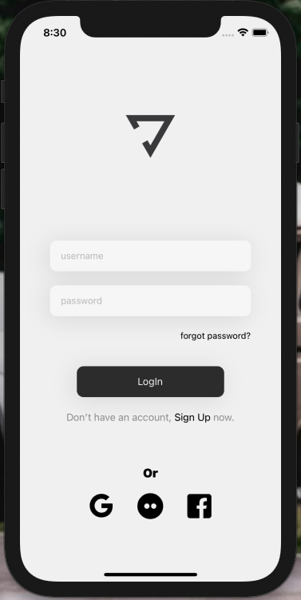
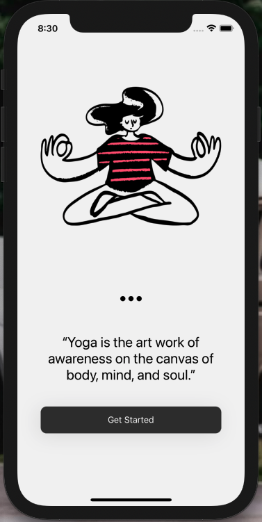

# Yoga app

Aplicação criada para estudos sobre testes unitários no react-native

> [Layout no figma aqui](https://www.figma.com/community/file/966256031420722379)

  
  

## Tecnologias utilizadas

- React-native
- Typescript
- Styled-components
- Jest
- @testing-library
